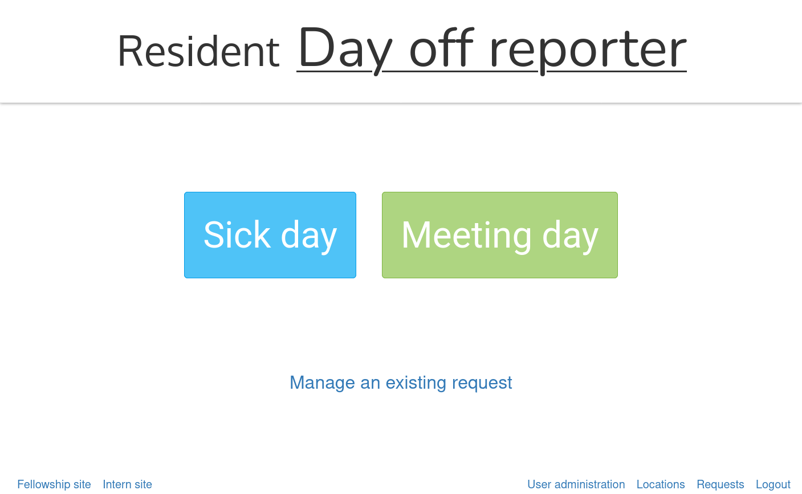

# Day off checker

This is a sick day and day off request management application designed for easy
use by medical trainees.
Different trainee types are handled via subdomains (residents using the primary
subdomain `www.`, interns using `intern.`, and fellows using `fellow.`).

A design requirement intended to reduce friction when submitting, **no
authentication** is performed before submission; users instead simply enter
their name and email address each time. I would not recommend this.

Submissions are associated with one or more dates and a single rotation
location, and preconfigured location administrators are notified via email when
a submission is performed for their location.
Preconfigured approvers (chief residents for residents, fellowship directors
for fellowships, and intern coordinators for interns) are also notified for
each submission of their respective type, and are required to approve or deny
day off requests.
Residency and Fellowship Coordinators are also notified of submissions for
their respective trainee types and can view submitted requests.

Preconfigured users who are notified of submissions **do** have accounts and
can log in to view requests about which they have been notified using a few
different views (table, calendar, and per-submitter breakdown identified by
email address).

Users can view the status of or cancel their existing submissions using a
unique link sent to them via email, or by entering its unique ID.
